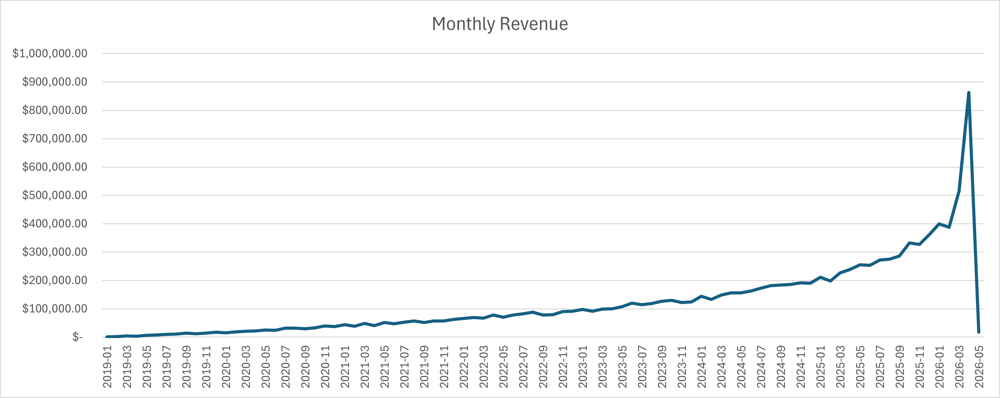
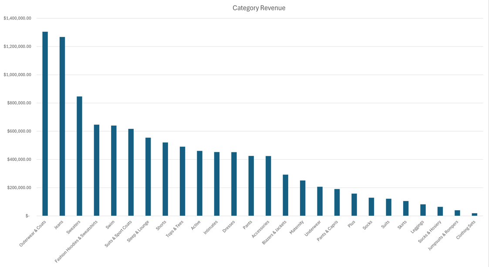

# SQL E-commerce Analysis Project

## Overview

This project analyzes an e-commerce dataset in BigQuery using SQL to evaluate business performance. The analysis focuses on revenue trends, product performance, customer behavior, and operational efficiency.

## Dataset Source

The dataset used in this project is the TheLook e-commerce dataset available through Google BigQuery public datasets. It simulates a real-world retail environment with orders, customers, and product data.

## Business Questions

1. How is revenue trending over time?
 2. Which product categories generate the most revenue?
  3. Who are the most active customers?
4. What is the distribution of order statuses?

## Tools Used

* SQL 
* Google BigQuery
* Excel (for charts)

## Analysis Summary

### Revenue Over Time

Revenue was aggregated by date to identify trends and fluctuations in sales performance over time.

### Revenue by Product Category

A JOIN between order and product tables was used to determine which categories generate the most revenue.

### Customer Behavior

Customer activity was analyzed by counting total orders per user to identify the most active customers.

### Order Status Breakdown

Order statuses were analyzed to understand operational performance, including completed, cancelled, and returned orders.

## Key Insights

* Revenue fluctuates over time, reflecting changes in customer demand.
* A small number of product categories generate the majority of revenue.
* A subset of customers accounts for a high number of total orders.
* Most orders are completed, but cancellations and returns highlight areas for operational improvement.
## Visualizations

## Files Included

* SQL_Ecommerce_Analysis.ipynb (Jupyter Notebook with queries and insights)

## Author

Camiell Garrett

